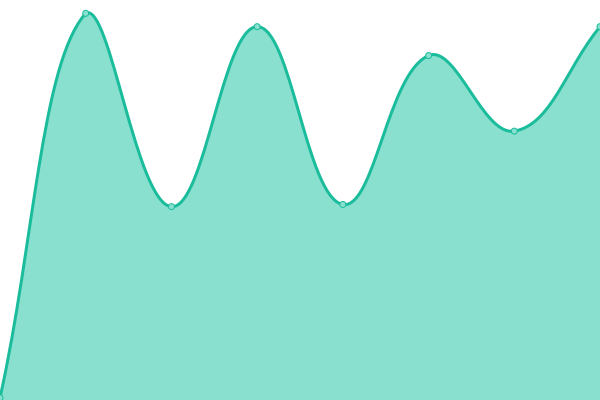
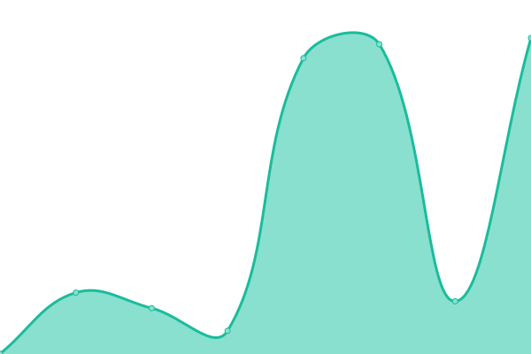
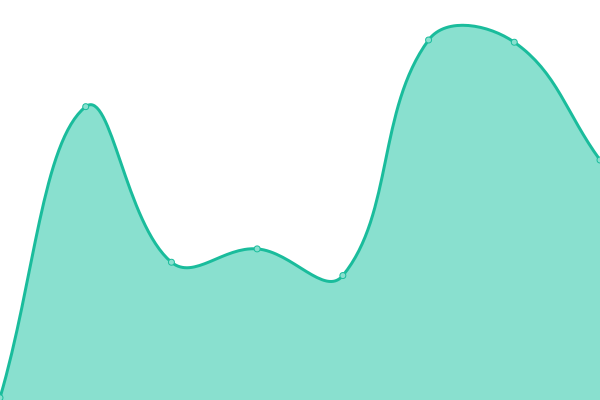
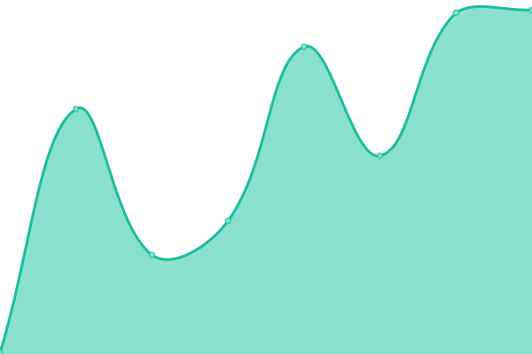
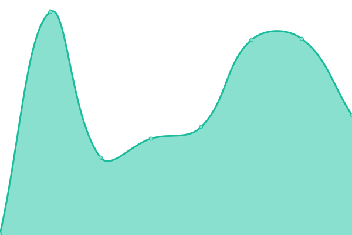
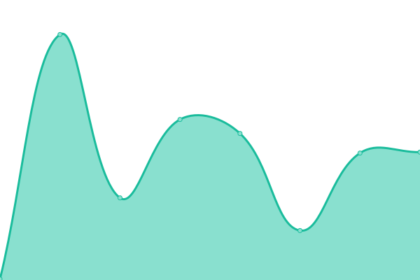

# [📈 Live Status](https://status.minung.dev): <!--live status--> **🟩 All systems operational**

This repository contains the open-source uptime monitor and status page for [minungHan](https://blog-new.minung.dev/about), powered by [Upptime](https://github.com/upptime/upptime).

With [Upptime](https://upptime.js.org), you can get your own unlimited and free uptime monitor and status page, powered entirely by a GitHub repository. We use [Issues](https://github.com/hmu332233/upptime/issues) as incident reports, [Actions](https://github.com/hmu332233/upptime/actions) as uptime monitors, and [Pages](https://status.minung.dev) for the status page.

<!--start: status pages-->
<!-- This summary is generated by Upptime (https://github.com/upptime/upptime) -->
<!-- Do not edit this manually, your changes will be overwritten -->
<!-- prettier-ignore -->
| URL | Status | History | Response Time | Uptime |
| --- | ------ | ------- | ------------- | ------ |
|  [blog](https://blog-new.minung.dev) | 🟩 Up | [blog.yml](https://github.com/hmu332233/upptime/commits/HEAD/history/blog.yml) | 

 117ms
     
 | 

<a href="https://status.minung.dev/history/blog">100.00%</a>
    

|  [gatsby-starter](https://minung.gatsbyjs.io) | 🟩 Up | [gatsby-starter.yml](https://github.com/hmu332233/upptime/commits/HEAD/history/gatsby-starter.yml) | 

 78ms
     
 | 

<a href="https://status.minung.dev/history/gatsby-starter">100.00%</a>
    

|  [help-jbnu--page](https://help-jbnu--page.minung.dev) | 🟩 Up | [help-jbnu-page.yml](https://github.com/hmu332233/upptime/commits/HEAD/history/help-jbnu-page.yml) | 

 96ms
     
 | 

<a href="https://status.minung.dev/history/help-jbnu-page">100.00%</a>
    

|  [q-link](https://q-link.minung.dev) | 🟩 Up | [q-link.yml](https://github.com/hmu332233/upptime/commits/HEAD/history/q-link.yml) | 

 1721ms
     
 | 

<a href="https://status.minung.dev/history/q-link">100.00%</a>
    

|  [moon.svg](https://moon-svg.minung.dev) | 🟩 Up | [moon-svg.yml](https://github.com/hmu332233/upptime/commits/HEAD/history/moon-svg.yml) | 

 103ms
     
 | 

<a href="https://status.minung.dev/history/moon-svg">100.00%</a>
    

|  [dday.widget](https://dday-widget.minung.dev) | 🟩 Up | [dday-widget.yml](https://github.com/hmu332233/upptime/commits/HEAD/history/dday-widget.yml) | 

 101ms
     
 | 

<a href="https://status.minung.dev/history/dday-widget">100.00%</a>
    

|  [tip-tap](https://tip-tap.minung.dev) | 🟩 Up | [tip-tap.yml](https://github.com/hmu332233/upptime/commits/HEAD/history/tip-tap.yml) | 

 1504ms
     
 | 

<a href="https://status.minung.dev/history/tip-tap">100.00%</a>
    

|  [celebration](https://celebration.minung.dev) | 🟩 Up | [celebration.yml](https://github.com/hmu332233/upptime/commits/HEAD/history/celebration.yml) | 

 109ms
     
 | 

<a href="https://status.minung.dev/history/celebration">100.00%</a>
    

|  [web-recorder](https://web-recorder.minung.dev) | 🟩 Up | [web-recorder.yml](https://github.com/hmu332233/upptime/commits/HEAD/history/web-recorder.yml) | 

 94ms
     
 | 

<a href="https://status.minung.dev/history/web-recorder">100.00%</a>
    

|  [peer-voice](https://peer-voice.minung.dev) | 🟩 Up | [peer-voice.yml](https://github.com/hmu332233/upptime/commits/HEAD/history/peer-voice.yml) | 

 78ms
     
 | 

<a href="https://status.minung.dev/history/peer-voice">100.00%</a>
    

|  [tips](https://tips.minung.dev) | 🟩 Up | [tips.yml](https://github.com/hmu332233/upptime/commits/HEAD/history/tips.yml) | 

 94ms
     
 | 

<a href="https://status.minung.dev/history/tips">100.00%</a>
    

|  [lecture-ranking](https://lecture-ranking.vercel.app) | 🟩 Up | [lecture-ranking.yml](https://github.com/hmu332233/upptime/commits/HEAD/history/lecture-ranking.yml) | 

 48ms
     
 | 

<a href="https://status.minung.dev/history/lecture-ranking">100.00%</a>
    

<!--end: status pages-->

[**Visit our status website →**](https://status.minung.dev)

## 📄 License

- Powered by: [Upptime](https://github.com/upptime/upptime)
- Code: [MIT](./LICENSE) © [minungHan](https://blog-new.minung.dev/about)
- Data in the `./history` directory: [Open Database License](https://opendatacommons.org/licenses/odbl/1-0/)
